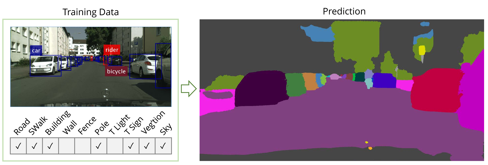

# Weakly- and Semi-Supervised Panoptic Segmentation
by [Qizhu Li](http://www.robots.ox.ac.uk/~liqizhu/)\*, [Anurag Arnab](http://www.robots.ox.ac.uk/~aarnab/)\*, [Philip H.S. Torr](https://scholar.google.com/citations?user=kPxa2w0AAAAJ&hl=en)

This repository demonstrates the weakly supervised ground truth generation scheme presented in our paper *Weakly- and Semi-Supervised Panoptic Segmentation* published at ECCV 2018. The code has been cleaned-up and refactored, and should reproduce the results presented in the paper.

For details, please refer to our [paper](https://arxiv.org/abs/1808.03575), and [project page](https://qizhuli.github.io/publication/weakly-supervised-panoptic-segmentation/). Please check the [Downloads](#downloads) section for all the additional data we release.




<sup><sub> \* Equal first authorship </sup></sub>

## Introduction
In our weakly-supervised *panoptic* segmentation experiments, our models are supervised by 1) image-level tags and 2) bounding boxes, as shown in the figure above.
We used image-level tags as supervision for "stuff" classes which do not have a defined extent and cannot be described well by tight bounding boxes. For "thing" classes, we used bounding boxes as our weak supervision. This code release clarifies the implementation details of the method presented in the paper.

## Iterative ground truth generation 
For readers' convenience, we will give an outline of the proposed iterative ground truth generation pipeline, and provide demos for some of the key steps.

1. We train a multi-class classifier for all classes to obtain rough localisation cues. As it is not possible to fit an entire Cityscapes image (1024x2048) into a network due to GPU memory constraints, we took 15 fixed 400x500 crops per training image, and derived their classification ground truth accordingly, which we use to train the multi-class classifier. From the trained classifier, we extract the Class Activation Maps (CAMs) using Grad-CAM, which has the advantage of being agnostic to network architecture over CAM.
   - Download the fixed image crops with image-level tags [here](#downloads-crops) to train your own classifier. For convenience, the pixel-level semantic label of the crops are also included, though they should not be used in training.
   - The CAMs we produced are available for download [here](#downloads-cam).
2. In parallel, we extract bounding box annotations from Cityscapes ground truth files, and then run MCG (a segment-proposal algorithm) and Grabcut (a classic foreground segmentation technique given a bounding-box prior) on the training images to generate foreground masks inside each annotated bounding box. MCG and Grabcut masks are merged following the rule that only regions where both have consensus are given the predicted label; otherwise an "ignore" label is assigned.
   - The extracted bounding boxes (saved in .mat format) can be downloaded [here](#downloads-bboxes). Alternatively, we also provide a demo script `demo_instanceTrainId_to_dets.m` and a batch script `batch_instanceTrainId_to_dets.m` for you to make them yourself. The demo is self-contained; However, before running the batch script, make sure to
        1. Download the [official Cityscapes scripts repository](https://github.com/mcordts/cityscapesScripts);
        2. Inside the above repository, navigate to `cityscapesscripts/preparation` and run 
        
            ```sh
            python createTrainIdInstanceImgs.py
            ```
            This command requires an environment variable `CITYSCAPES_DATASTET=path/to/your/cityscapes/data/folder` to be set. These two steps produce the `*_instanceTrainIds.png` files required by our batch script;
        3. Navigate back to this repository, and place/symlink your `gtFine` and `gtCoarse` folders inside `data/Cityscapes/` folder so that they are visible to our batch script.
   - Please see [here](https://github.com/jponttuset/mcg) for details on MCG.
   - We use the [OpenCV implementation](https://docs.opencv.org/3.2.0/d8/d83/tutorial_py_grabcut.html) of Grabcut in our experiments.
   - The merged M&G masks we produced are available for download [here](#downloads-mandg).
3. The CAMs (step 1) and M&G masks (step 2) are merged to produce the ground truth needed to kick off iterative training. To see a demo of merging, navigate to the root folder of this repo in MATLAB and run:
   ```matlab
    demo_merge_cam_mandg;
   ```
   When post-processing network predictions of images from the Cityscapes `train_extra` split, make sure to use the following settings:
   ```matlab
   opts.run_apply_bbox_prior = false;
   opts.run_check_image_level_tags = false;
   opts.save_ins = false;
   ```
   because the coarse annotation provided on the `train_extra` split trades off recall for precision, leading to inaccurate bounding box coordinates, and frequent occurrences of false negatives. This also applies to step 5.
    - The results from merging CAMs with M&G masks can be downloaded [here](#downloads-cam-mandg-merged).
4. Using the generated ground truth, weakly-supervised models can be trained in the same way as a fully-supervised model. When the training loss converges, we make dense predictions using the model and also save the prediction scores. 
   - An example of dense prediction made by a weakly-supervised model is included at `results/pred_sem_raw/`, and an example of the corresponding prediction scores is provided at `results/pred_flat_feat/`. 
5. The prediction and prediction scores (and optionally, the M&G masks) are used to generate the ground truth labels for next stage of iterative training. To see a demo of iterative ground truth generation, navigate to the root folder of this repo in MATLAB and run:
   ```matlab
   demo_make_iterative_gt;
   ```
    The generated semantic and instance ground truth labels are saved at `results/pred_sem_clean` and `results/pred_ins_clean` respectively. 
    
    Please refer to `scripts/get_opts.m` for the options available. To reproduce the results presented in the paper, use the default setting, and set `opts.run_merge_with_mcg_and_grabcut` to `false` after five iterations of training, as the weakly supervised model by then produces better quality segmentation of ''thing'' classes than the original M&G masks. 
6. Repeat step 4 and 5 until training loss no longer reduces.

## Downloads
1. <a id="downloads-crops"></a>Image crops and tags for training multi-class classifier:
   - Images 
        - train (9.3GB): [Dropbox](https://www.dropbox.com/s/xvumnk14qmctb41/leftImg8bit_400x500crops_train.zip?dl=0) or [BaiduYun](https://pan.baidu.com/s/1T0xTuq88RITHqZHW1Tdo-g)
        - train_extra (63.3GB): [Dropbox](https://www.dropbox.com/s/rana9b0e0k1d467/leftImg8bit_400x500crops_train_extra.zip?dl=0) or [BaiduYun](https://pan.baidu.com/s/1yy0I-0R5IBI98QLGOdjkiQ)
        - val (1.6GB): [Dropbox](https://www.dropbox.com/s/hudd1k4i4zr53qj/leftImg8bit_400x500crops_val.zip?dl=0) or [BaiduYun](https://pan.baidu.com/s/1jSCps4wNg45mbgM0ggM7AQ)
   - Ground truth tags
        - train+train_extra+val (90.9MB): [Dropbox](https://www.dropbox.com/s/z9ak8rtwjldyerv/gtWeak_tags_400x500crops.zip?dl=0) or [BaiduYun](https://pan.baidu.com/s/19VcJrQU2GvwX6NZu8jLWfg)
   - Lists
        - train+train_extra+val (827kB): [Dropbox](https://www.dropbox.com/s/8itgdm0nau0rixz/lists.zip?dl=0) or [BaiduYun](https://pan.baidu.com/s/14j9rV3S8599YwYILzEfrCw)
   - Semantic labels (provided for convenience; **not** to be used in training)
        - train (87.8MB): [Dropbox](https://www.dropbox.com/s/v9nsuazh60mwm4g/gtFine_semantic_400x500crops_train.zip?dl=0) or [BaiduYun](https://pan.baidu.com/s/1dOX7CO9J0ep94TJjUsSYzg)
        - train_extra (608MB): [Dropbox](https://www.dropbox.com/s/u45mtdvb3xqt2di/gtCoarse_semantic_400x500crops_train_extra.zip?dl=0) or [BaiduYun](https://pan.baidu.com/s/12Jf0XwvValq2MtFKDRMTmg)
        - val (16.2MB): [Dropbox](https://www.dropbox.com/s/9o9unhqnijz3bmm/gtFine_semantic_400x500crops_val.zip?dl=0) or [BaiduYun](https://pan.baidu.com/s/14RLV--kmnyhRQXQrTtwQ_A)
2. <a id="downloads-cam"></a>CAMs:
    - train+train_extra (682MB): [Dropbox](https://www.dropbox.com/s/24p60caieq3skik/cam.zip?dl=0) or [BaiduYun](https://pan.baidu.com/s/1zhgzw0IU7r9YBBBmwwRTzA)
3. <a id="downloads-bboxes"></a>Extracted Cityscapes bounding boxes (.mat format):
    - train+val (7.6GB): [Dropbox](https://www.dropbox.com/s/bt7tpom8nohtwk8/gtFine_bboxes.zip?dl=0) or [BaiduYun](https://pan.baidu.com/s/1jXEp-ibmXkQz-bi1Oe6FtA)
    - train_extra (44.2GB): [Dropbox](https://www.dropbox.com/s/tuv4r44sr5vt15z/gtCoarse_bboxes.zip?dl=0) or [BaiduYun](https://pan.baidu.com/s/1p8bpZ2srcNmHlkCrLnPH2Q)
4. <a id="downloads-mandg"></a>Merged MCG&Grabcut masks:
    - train+train_extra (99.8MB): [Dropbox](https://www.dropbox.com/s/skwv2f8ny0aym9j/mcg_and_grabcut.zip?dl=0) or [BaiduYun](https://pan.baidu.com/s/1VvcodHbuZz4nJhVego5jwA)
5. <a id="downloads-cam-mandg-merged"></a>CAMs merged with MCG&Grabcut masks:
    - train+train_extra (764MB): [Dropbox](https://www.dropbox.com/s/t24gqpkyrytr7ai/cam_mandg_merged.zip?dl=0) or [BaiduYun](https://pan.baidu.com/s/1vI2tzbzXCEO3tij4RnMzgg)

Note that due to file size limit set by **BaiduYun**, some of the larger files had to be split into several chunks in order to be uploaded. These files are named as `filename.zip.part##`, where `filename` is the original file name excluding the extension, and `##` is a two digit part index. After you have downloaded all the parts, `cd` to the folder where they are saved, and use the following command to join them back together:
```sh
cat filename.zip.part* > filename.zip
```
The joining operation may take several minutes, depending on file size. 

The above does not apply to files downloaded from Dropbox.

## Reference
If you find the code helpful in your research, please cite our paper:

```tex
@inproceedings{li2018wsps,
    author = {Qizhu Li and
              Anurag Arnab and
              Philip H.S. Torr},
    title = {Weakly- and Semi-Supervised Panoptic Segmentation},
    booktitle = {European Conference on Computer Vision (ECCV)},
    year = {2018}
}
```
## Questions
Please contact Qizhu Li <qizhu.li@eng.ox.ac.uk> and Anurag Arnab <aarnab@robots.ox.ac.uk> for enquires, issues, and suggestions.
